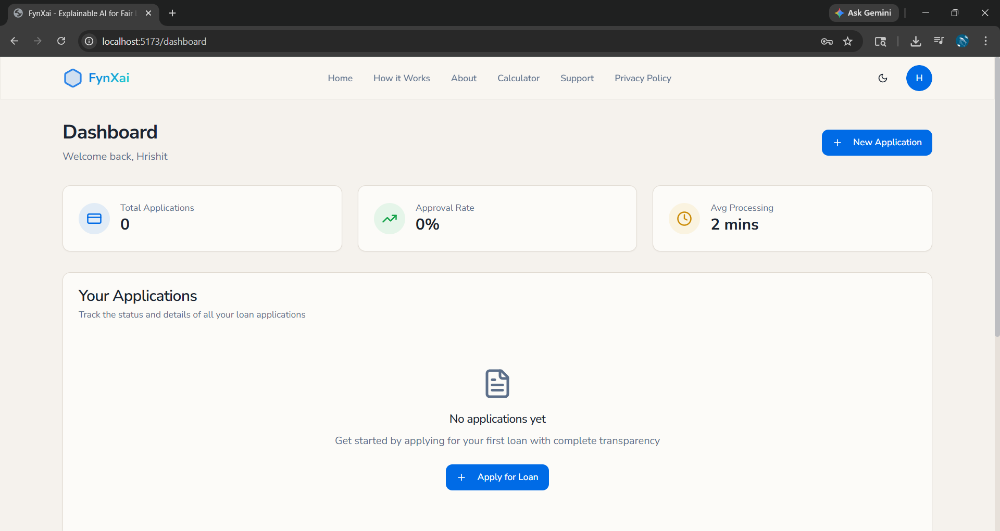
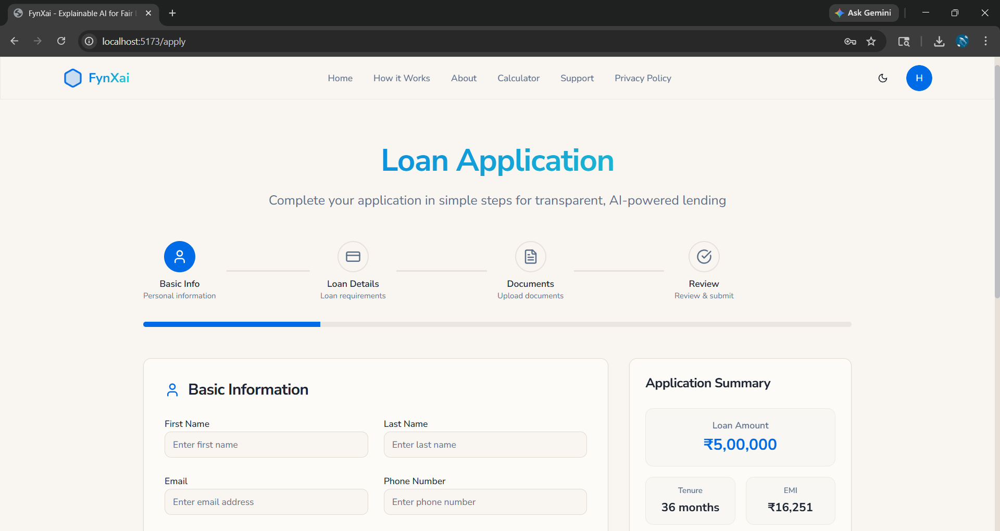
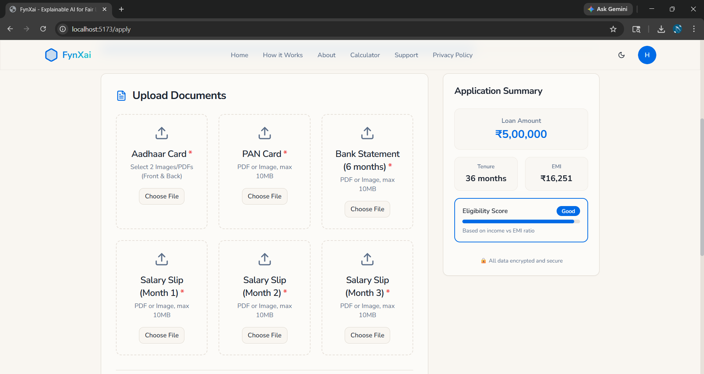
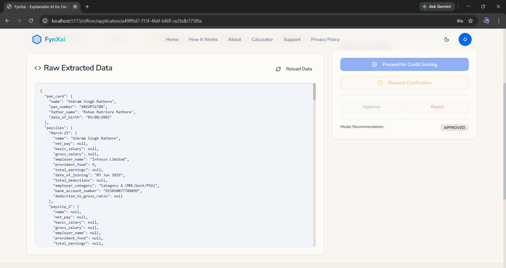
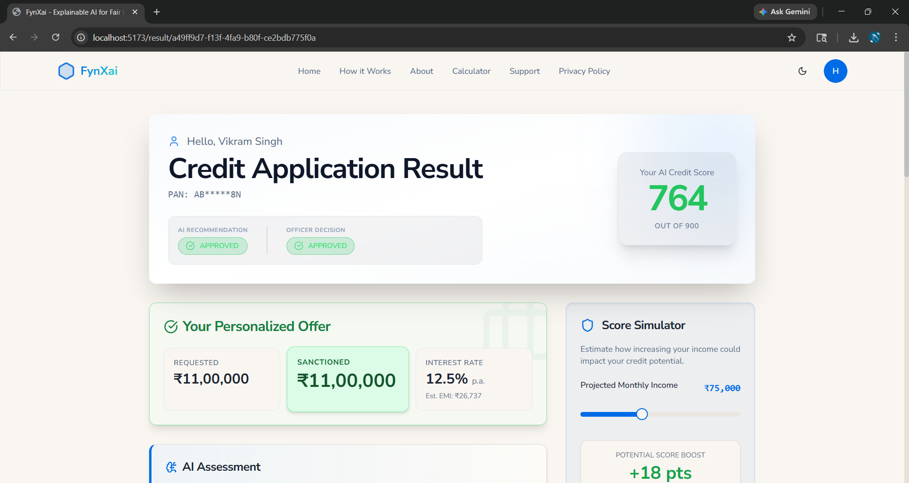
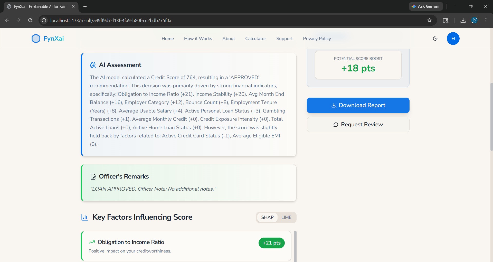

# 🧠 FynXai: Explainable Credit Decision Engine

_A document-driven credit scoring system using OCR, machine learning, and explainable AI for transparent and reliable lending decisions._

<p align="center">
  
  
  
  
  
</p>

---

## 📖 Table of Contents

- [📝 Project Overview](#-project-overview)
- [✨ Key Features](#-key-features)
- [🏛️ System Architecture](#-system-architecture)
- [🛠️ Technologies Used](#-technologies-used)
- [🚀 Getting Started](#-getting-started)
- [📸 Screenshots](#-screenshots)

---

## 📝 Project Overview

### The Challenge

Traditional credit scoring systems rely primarily on structured datasets and rule-based approaches.
These systems often fail to leverage valuable financial information present in real-world documents such as bank statements, salary slips, and identity proofs.
Additionally, modern machine learning models improve prediction accuracy but introduce a lack of transparency in decision-making.

---

### The Solution

FynXai provides an integrated framework that combines document intelligence with explainable machine learning.

The system:

- Extracts financial and identity data from documents using OCR and PDF parsing
- Converts extracted data into structured financial features
- Applies an XGBoost model to predict credit scores and loan eligibility
- Generates explanations using SHAP and LIME
- Supports human-in-the-loop validation for final decision making

---

## ✨ Key Features

- 📄 **Document Processing**
  Extraction of structured data from financial and identity documents using OCR and PDF parsing.

- 🧮 **Feature Engineering**
  Generation of financial and behavioral attributes representing applicant creditworthiness.

- 🤖 **Credit Scoring Model**
  XGBoost-based model for accurate credit score prediction.

- 🔍 **Explainable AI**
  SHAP and LIME provide global and instance-level interpretability.

- 👨‍⚖️ **Decision Support System**
  Loan officer review ensures accountability and validation.

- 🔐 **Integrated Backend & Storage**
  Supabase-based authentication and structured data storage.

---

## 🏛️ System Architecture

FynXai follows a layered architecture designed for scalability and transparency:

1. **Frontend Layer**
   Built using React and Vite, providing interfaces for applicants and loan officers.

2. **Backend API Layer**
   FastAPI-based services handling document processing, scoring, and explainability.

3. **Document Processing Layer**
   OCR (EasyOCR) and PDF parsing (PyPDF2, pdfplumber) extract structured data.

4. **Feature Engineering Layer**
   Transforms extracted data into standardized financial attributes.

5. **Prediction Layer**
   XGBoost model generates credit scores and eligibility decisions.

6. **Explainability Layer**
   SHAP and LIME interpret model predictions.

7. **Decision Layer**
   Loan officer reviews results and finalizes decisions.

---

## 🛠️ Technologies Used

- **Frontend**: React (Vite + TypeScript), Tailwind CSS, shadcn/ui
- **Backend**: FastAPI, Python
- **Machine Learning**: XGBoost
- **OCR & Parsing**: EasyOCR, PyPDF2, pdfplumber
- **Explainability**: SHAP, LIME
- **Database**: Supabase (PostgreSQL)

---

## 🚀 Getting Started

Follow these steps to set up and run the project locally.

### Prerequisites

- Node.js (v18 or higher)
- Python (v3.8 or higher)
- Supabase project

---

### 1. Clone the Repository

```bash
git clone https://github.com/your-username/fynxai.git
cd fynxai
```

---

### 2. Backend Setup

```bash
cd backend

python -m venv venv
source venv/bin/activate        # macOS/Linux
# .\venv\Scripts\activate      # Windows

pip install -r requirements.txt
cp .env.example .env
```

Run the backend server:

```bash
uvicorn main:app --reload
```

Backend will run at:

```
http://localhost:8000
```

---

### 3. Frontend Setup

```bash
cd frontend

npm install
cp .env.example .env
```

Run the frontend:

```bash
npm run dev
```

Frontend will run at:

```
http://localhost:5173
```

---

### 4. Environment Configuration

Backend `.env`:

```env
SUPABASE_URL=your_supabase_project_url
SUPABASE_KEY=your_supabase_anon_public_key
SUPABASE_SERVICE_ROLE_KEY=your_supabase_service_role_key
```

Frontend `.env`:

```env
VITE_SUPABASE_URL=your_supabase_project_url
VITE_SUPABASE_ANON_KEY=your_supabase_anon_public_key
VITE_API_BASE_URL=http://localhost:8000
```

---

## 📸 Screenshots

The following screenshots illustrate the system workflow and user interface:

- 🏠 **User Dashboard**
  

- 📝 **Loan Application Form**
  

- 📄 **Document Upload Interface**
  

- 🔍 **Extracted Financial Data**
  

- 📊 **Credit Score Output**
  

- 🧠 **Explainability Insights**
  

---

## 👨‍💻 Contributors

- Hrishit Patil
- Sanket Nandurkar
- Ayush Nayak
- Om Nandurkar

---

## 📜 License

MIT License
